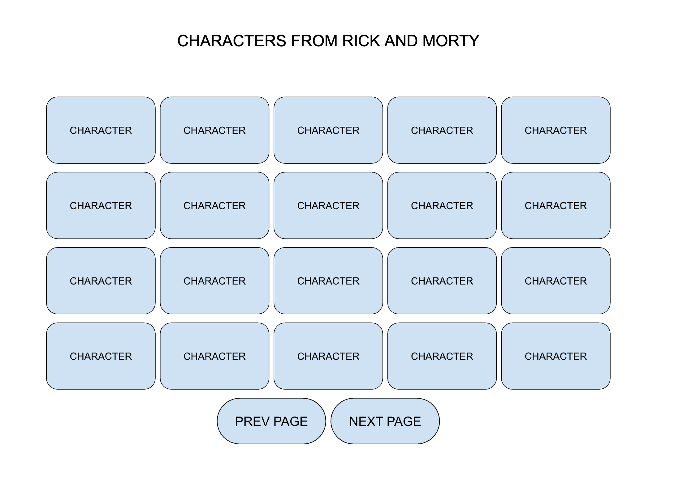
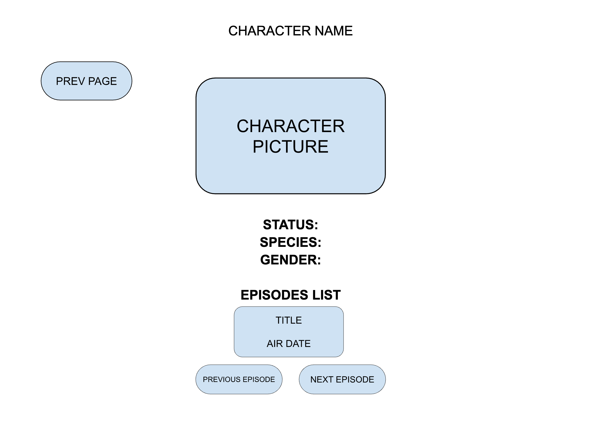
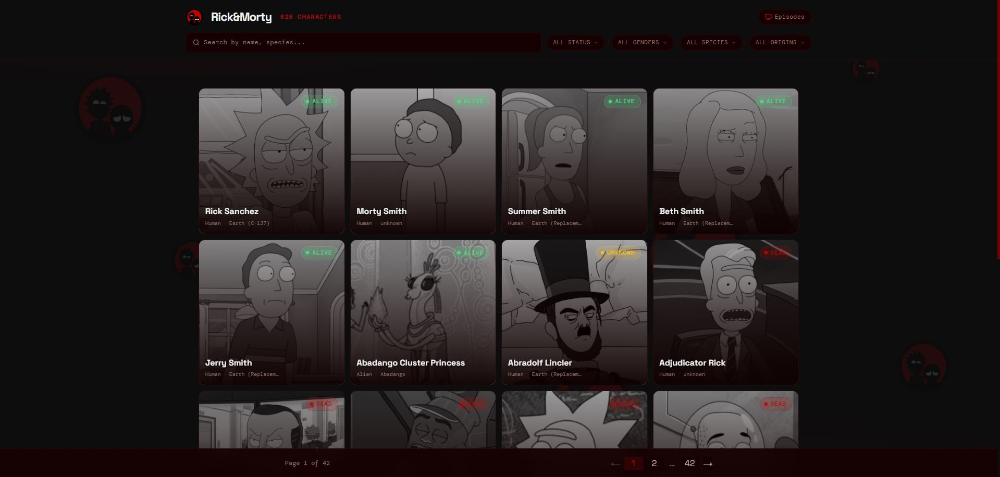
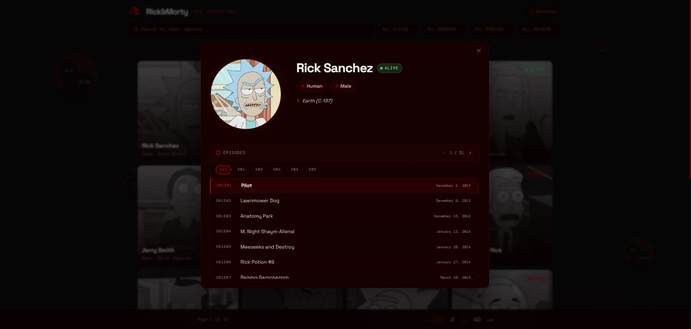
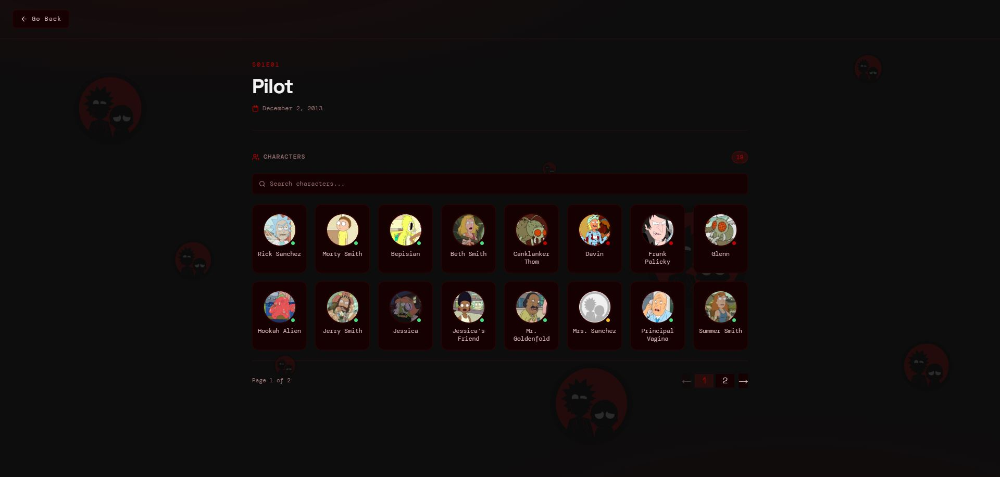
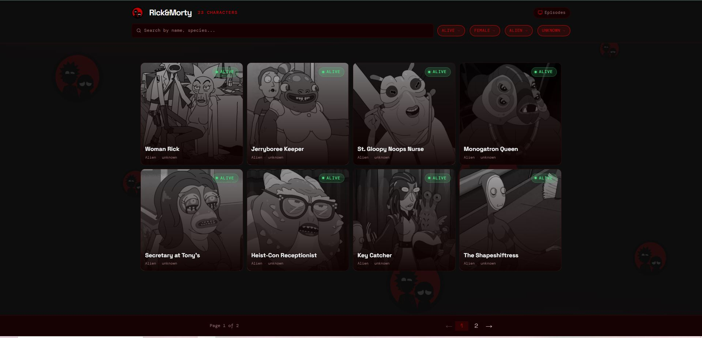
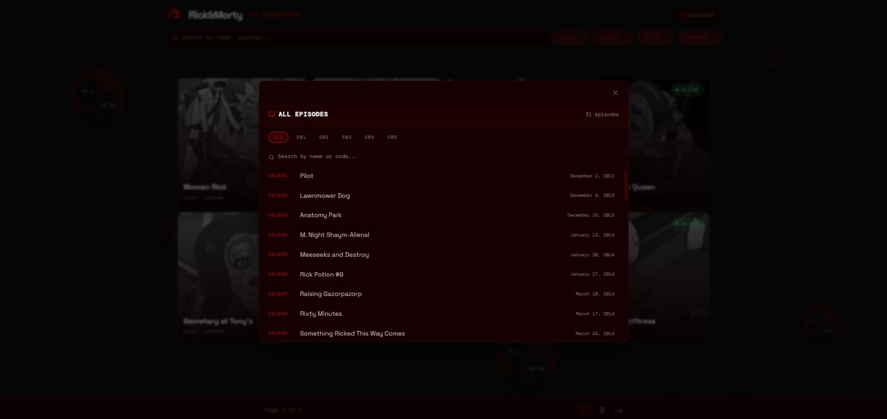
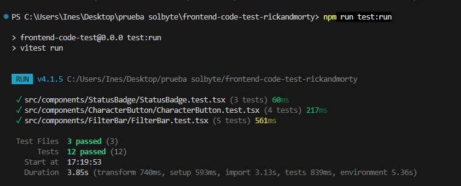
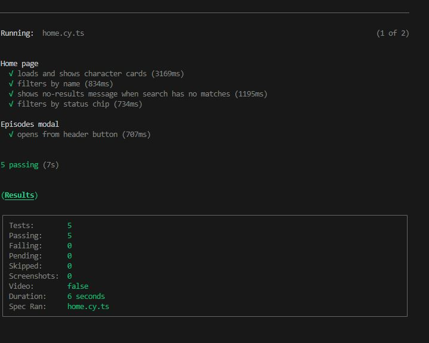
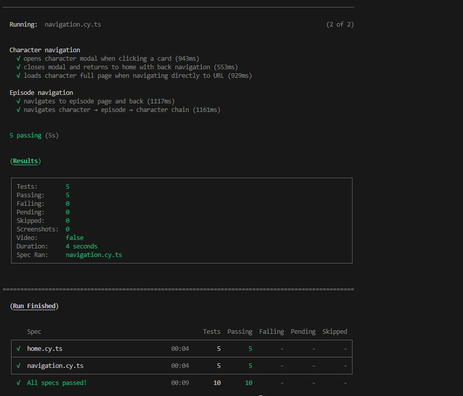

# Code Test

## Assignment

The application is setup with React Router containing two routes. The goal of
the assignment is to create these two pages based on the requirements. The assignment must be in a state where it is ready
from the assignee point of view to be pushed to production. What is written down is the bare minimum, but it could be improved
as the assignee would like to so its at his/her standard of production ready

The data is fetched from
[Rick & Morty API](https://rickandmortyapi.com/documentation/#graphql)
with the already setup [urql](https://formidable.com/open-source/urql/) client.

The styling method is free of choice, it could be with css, scss, css-in-js or
other preferences.

- `/` - the home page
- `/character/:id` - the character page

### Home page

This page should list all the characters from the Rick & Morty API, paginated, displayed in batches of 20. Navigation has
to be implemented at least with some typical small arrows. Each person character must be linked to its own page.

As a general mockup, it should look like this:



### Person page

This page should contain an overview of the character

- Name
- Status
- Image
- Gender
- Origin

And then a separate section that will display the EPISODES where the character appeared,
sorted by air time, displaying the title and the air date, that allos the user to navigate through
them by clicking on arrows.

User must be able to get back to the previous page with a GO BACK button as well. As a mockup 
you can get inspired by this image:



## Setup

Install dependencies (using NPM)

```bash
$ npm install
```

Download GraphQL Schema

```bash
$ npm run download-schema
```

Generate GraphQL Types (generated types will be in `src/generated/graphql.ts`

```bash
$ npm run codegen
```

Start dev mode

```bash
$ npm run dev
```

---

## Implementation

### Tech stack

| Layer | Choice | Reason |
|---|---|---|
| Framework | React 19 + TypeScript + Vite | Modern setup, fast HMR |
| Routing | React Router DOM v7 | Modal overlay pattern with `location.state` |
| Data fetching | urql + GraphQL | Lightweight vs Apollo, sufficient for read-only queries |
| Styling | SCSS Modules + CSS custom properties | Full design control, scoped classes, dark theme via CSS vars |
| Component library | shadcn/ui + Radix UI | Accessible primitives (Dialog, Select, Tooltip) without opinionated styles |
| Icons | lucide-react | Consistent icon set, tree-shakeable |
| Testing | Vitest + Testing Library + Cypress | Unit tests for components, E2E for user flows |

---

### Pages

#### Home page — `/`

Characters paginated in a responsive grid (4 cols desktop / 3 tablet / 2 mobile). Filters by name (debounced), origin and status. Fixed header with FilterBar.




#### Character page — `/character/:id`

Character detail with circular image (click to lightbox), status badge, species/gender pills, origin, and episode navigator with season filter. Opens as a modal overlay when navigated from the grid, or as a full page when accessed directly by URL.




#### Episode page — `/episode/:id`

Full page for a single episode showing all characters. Supports the navigation chain: character → episode → character → back → episode → back → character.



#### FilterBar



#### Episodes modal



---

### Key technical decisions

**Modal routes with `location.state.background`**  
`/character/:id` renders as a modal on top of the home grid when coming from a card click, or as a standalone full page when visited directly. One component, two behaviours — URL is always shareable.

**urql with sequential pagination (`useAllEpisodes`)**  
The Rick & Morty API paginates episodes (20/page). To show all seasons in the filter, pages are fetched sequentially using urql's `pause` option and accumulated in state. Parallel fetching is not possible without knowing total pages upfront.

**CSS Modules + CSS custom properties**  
Design tokens (colors, radii, transitions) live in `:root` CSS variables. Components use SCSS Modules for scoped class names. Shared patterns (scrollbars, season chips, episode open buttons) are SCSS mixins in `_mixins.scss`.

**Reusable `CharacterButton` component**  
Identical JSX (avatar circle + status dot + name) appeared in both `EpisodePage` and `EpisodeModal`. Extracted to a single component with a `variant` prop (`"card"` with border/background vs `"minimal"` plain).

**shadcn/ui usage**
- `Skeleton` — animated placeholder cards in the character grid while loading
- `Select` (Radix) — status filter in the FilterBar
- `Tooltip` (Radix) — status label on character avatar dots
- `Dialog` (Radix) — modal overlay and lightbox
- `Badge` — status badge (Alive / Dead / Unknown)

---

### Project structure

```
src/
├── components/
│   ├── CharacterButton/   # Reusable avatar+status+name button
│   ├── CharacterCard/     # Poster-style grid card (grayscale → color on hover)
│   ├── Dialog/            # Generic Radix Dialog wrapper
│   ├── EpisodeNavigator/  # Season filter + scrollable episode list
│   ├── EpisodesModal/     # All episodes browser (fetches all pages)
│   ├── ErrorMessage/      # Inline error state component
│   ├── FilterBar/         # Name / gender / species / origin filters
│   ├── Loader/            # Loading spinner
│   ├── Pagination/        # Prev / next page controls
│   ├── StatusBadge/       # Alive / Dead / Unknown pill badge
│   └── ui/                # shadcn primitives (Badge, Button, Card, Select, Skeleton, Tooltip)
├── graphql/
│   └── queries.ts         # All GraphQL query documents
├── hooks/
│   ├── useAllEpisodes.ts  # Sequential multi-page episode fetcher
│   ├── useBreakpoint.ts   # Returns 'mobile' | 'tablet' | 'desktop' + helpers
│   ├── useCharacter.ts
│   ├── useCharacters.ts
│   ├── useDebounce.ts
│   ├── useEpisode.ts
│   ├── useEpisodes.ts     # Single-page episode query
│   ├── useIsMobile.ts     # Re-exports useIsMobile from useBreakpoint
│   └── usePagination.ts
├── lib/
│   ├── urqlClient.ts      # urql GraphQL client setup
│   └── utils.ts           # shadcn cn() utility
├── pages/
│   ├── HomePage/
│   ├── CharacterPage/
│   └── EpisodePage/
├── styles/
│   ├── _mixins.scss       # mobile/tablet/tablet-and-below/desktop mixins + UI helpers
│   ├── global.scss        # CSS variables, fonts, body decorations
│   └── tw-animate.css     # Tailwind animation utilities
├── test/
│   └── setup.ts           # Vitest global setup
├── types/
│   └── index.ts           # Shared TypeScript types
└── utils/
    └── constants.ts       # STATUS_COLOR shared constant
```

---

### Running tests

Unit tests (Vitest + Testing Library):

```bash
npm run test:run
```

E2E tests (Cypress — requires dev server running):

```bash
npm run dev          # terminal 1
npm run test:e2e     # terminal 2
```

All tests at once:

```bash
npm run test:all
```

#### Unit test results (Vitest headless)



#### E2E test results (Cypress)




